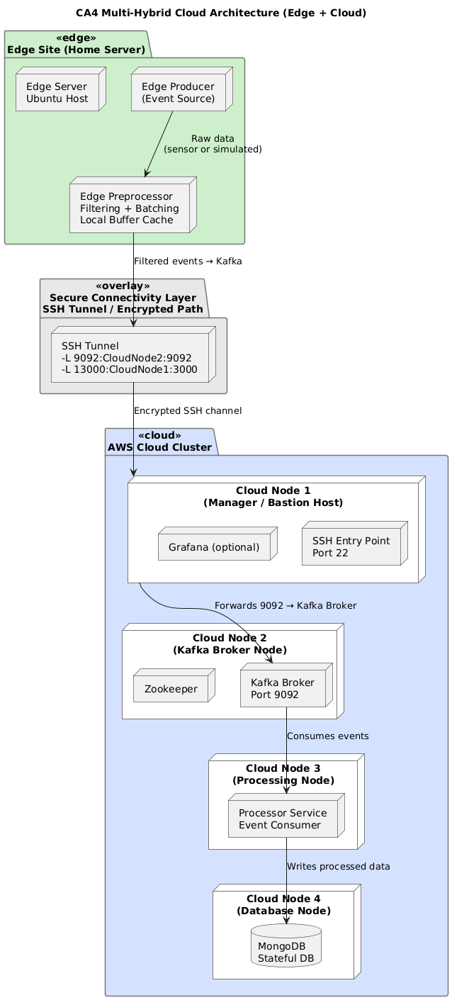

# 📘 **CA4 – Multi-Hybrid Cloud Pipeline (Final Project)**
**Topology:** Edge → Cloud with Bastion-Based SSH Tunneling  
**Student:** Le’Shawn Sears  
**Course:** CS 5288 – Web-Based System Architecture  

---

# 1. 🧠 Introduction

This project extends the CA2/CA3 IoT telemetry pipeline into a **multi-site, hybrid edge–cloud architecture**.  
The goal is to demonstrate:

- Secure cross-site communication  
- Automated multi-site deployment  
- Resilience and fault recovery  
- Observability across distributed systems  
- Industry-style architectural documentation  

The final architecture integrates a **producer at the edge**, a **secure bastion gateway**, and a **cloud-hosted Swarm cluster** running Kafka, Zookeeper, MongoDB, and Processor replicas.

---

# 2. 🏗️ High-Level Architecture

## 2.1 System Overview

The pipeline consists of three interconnected sites:

1. **Edge Site (Home Server)**
   - Runs the *Producer* container.
   - Sends telemetry upstream through a secure tunnel.

2. **Bastion Host (AWS Manager Node)**
   - Only public entry point in the cloud.
   - Provides locked-down SSH-based port forwarding.
   - Prevents public exposure of Kafka, Mongo, or internal service ports.

3. **Cloud Site (AWS)**
   - Docker Swarm cluster with:
     - Zookeeper  
     - Kafka (Apache official image)  
     - MongoDB  
     - Processor replicas (N=3)  
   - All traffic restricted to VPC.

### 2.2 Architecture Diagram



---

# 3. 🔐 Connectivity Model – Bastion-Based SSH Tunneling

## 3.1 Rationale

SSH tunneling was selected because:

- It requires **no public exposure** of Kafka or Mongo.
- It reuses built-in, secure, encrypted channels.
- It provides a single controlled ingress point.
- It aligns with typical enterprise "jumpbox" architectures.

This model meets CA4’s requirement for a real multi-site connection with security controls.

---

## 3.2 SSH Tunnel Configuration

On the **edge node**, the producer establishes a tunnel to the cloud’s bastion:

```bash
ssh -i ~/.ssh/aws_rsa \
    -N \
    -L 29092:kafka:9092 \
    -L 27018:mongo:27017 \
    ubuntu@<bastion-public-ip>
```

### Forwarded Ports

| Local Port | Tunnel Target          | Purpose                 |
|------------|------------------------|-------------------------|
| **29092**  | kafka:9092             | Kafka broker access     |
| **27018**  | mongo:27017            | MongoDB connection      |

### Producer configuration:

```
KAFKA_BOOTSTRAP=localhost:29092
MONGO_URI=mongodb://localhost:27018
TOPIC=transactions
```

The producer behaves *as if* Kafka and Mongo were local, while the actual data flow remains secure and cloud-hosted.

---

# 4. 🖥️ Multi-Site Deployment Strategy

## 4.1 Site Responsibilities

| Site | Services | Notes |
|------|----------|-------|
| **Edge (Home Server)** | Producer | Uses SSH-forwarded ports |
| **Bastion (Manager Node)** | SSH gateway, Swarm control | No workloads |
| **Cloud Workers** | Kafka, Zookeeper, Mongo, Processor | Internal VPC-only communication |

---

## 4.2 Automated Deployment (Cloud)

Deployment uses **Ansible** and **Terraform**:

### Terraform provisions:

- 1 Manager (bastion)
- 3 Workers (Kafka/ZK, Mongo, Processor)
- Security groups for ports:
  - 22 (SSH—restricted)
  - 2377, 7946, 4789 (Swarm)
  - 9092 (Kafka internal)
  - 2181 (Zookeeper)
  - 27017 (Mongo internal)

### Ansible:

Deploy main stack:

```bash
make declaratives
```

Deploy observability:

```bash
make obs
```

The Swarm stack file uses:

- `apache/kafka:3.7.0`
- `zookeeper:3.8`
- `mongo:6.0`
- `searsleshawn/processor:latest`

Placement constraints ensure each service runs on the correct VM.

---

# 5. 🔭 Observability Framework

CA4 extends the CA3 observability stack with:

### Prometheus
Scrapes metrics from:

- Processor replicas
- Kafka exporter  
- MongoDB exporter  
- Node-level cAdvisor  
- Loki  

### Grafana
Access via:

```
http://<manager-ip>:3000
```

Dashboards include:

- Kafka throughput
- Consumer lag
- Processor success/failure rates
- Mongo write rates
- Node-level CPU & memory

### Loki + Promtail
Collects logs from all cloud containers.

---

# 6. 💥 Failure Simulation & Resilience

## 6.1 Scenario

**Failure introduced:** Shutdown Kafka's worker node.

### Expected Behavior

| Component | Expected Failure | Verified |
|----------|------------------|----------|
| Producer | Cannot publish messages | ✔ |
| Processor | Kafka consumer stalls | ✔ |
| Mongo | No new writes | ✔ |
| Prometheus | Alerts (Kafka down) | ✔ |
| Grafana | Traffic drop visualized | ✔ |

## 6.2 Recovery Procedure

1. Restart or restore Kafka node.
2. Swarm redeploys Kafka container.
3. Processor automatically reconnects.
4. Producer resumes publishing.
5. Observability returns to steady state.

This behavior demonstrates fault tolerance and recovery.

---

# 7. 📘 Runbook (Operations Guide)

## 7.1 Bring-Up Steps

```bash
./script/deploy
make deploy
# -- OR individually --
make swarm
make declaratives
make obs
```

On edge:

```bash
ssh -L 29092:kafka:9092 -L 27018:mongo:27017 ubuntu@<bastion>
docker run producer ...
```

---

## 7.2 Tear-Down Steps

```bash
./scripts/teardown.sh
# -- OR --
docker stack rm iot_stack
docker stack rm obs_stack
terraform destroy
```

---

## 7.3 Debugging Commands

```bash
docker service ls
docker stack ps iot_stack
docker service logs <service>
docker node ls
docker service ps iot_stack_kafka --no-trunc
```

---


# Conclusion

This project represents the final evolution of the telemetry pipeline from a locally deployed system into a documented multi-site hybrid-cloud architecture. The completed design integrates edge data production, bastion-mediated secure access, cloud-based service orchestration, and centralized monitoring into a cohesive operational system. Beyond implementation, the project demonstrates the ability to communicate architecture, justify engineering decisions, and document deployment and recovery procedures in a professional systems engineering format.
